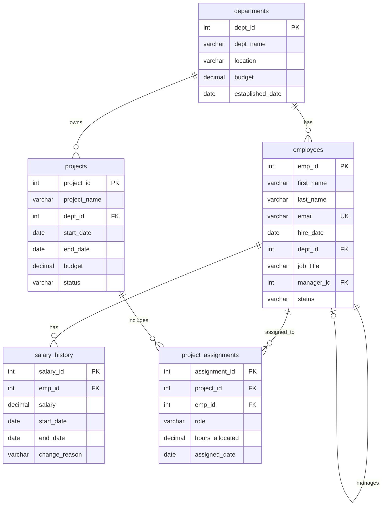

# SQL Guidebook - Comprehensive SQL Query Reference
**IDS 706 - Week 7 Major Assignment**  
**Due: October 19, 2025**

---

```stl
                                                                                ì            €¿–C«ÀX9ŽÁ    )\ŸÀ®G‰Á    ü©‘¿î|«Á                €¿)\ŸÀ®G‰Á    ÍÌ,À¸UÁ    ü©‘¿î|«Á                €¿D‹ô@ƒlA    NbAPgA    ÍÌ,Àq=ê@                €¿ÓMA–CaA    ÍÌ,Àq=ê@    NbAPgA                €¿{A¤pYA    ÍÌ,Àq=ê@    ÓMA–CaA                €¿mçÓ@ÓMpA    D‹ô@ƒlA    ÍÌ,Àq=ê@                €¿ªñ"Aã¥QA    ÍÌ,Àq=ê@    {A¤pYA                €¿b*A¶óIA    ÍÌ,Àq=ê@    ªñ"Aã¥QA                €¿Ë¡/AÍÌ@A    ÍÌ,Àq=ê@    b*A¶óIA                €¿
×3A×£4A    ÍÌ,Àq=ê@    Ë¡/AÍÌ@A                €¿åЦ@¸sA    mçÓ@ÓMpA    ÍÌ,Àq=ê@                €¿ÓMR@¸uA    åЦ@¸sA    ÍÌ,Àq=ê@                €¿Há6A…ë#A    ÍÌ,Àq=ê@    
×3A×£4A                €¿ªñ8A 
A    ÍÌ,Àq=ê@    Há6A…ë#A                €¿?5:A}?Ý@    ÍÌ,Àq=ê@    ªñ8A 
A      x?ÛÚƒ½    …7A‡€Á    Nb8A´ÈrÁ    Nb8A´ÈrÁ   A  x?ÛÚƒ½    …7A‡€Á    Nb8A´ÈrÁ   A…7A‡€Á   A            €¿é&;AÏ÷£?    ÍÌ,Àq=ê@    `å:ATã@                €¿VâÀ7‰¤Á    š™À^º«Á    ÇKçÀj¦Á                €¿¸9AF¶aÁ    ÍÌ,À¸UÁ    Â9A`åLÁ                €¿Â9A`åLÁ    ÍÌ,À¸UÁ    ¢E:A¢E4Á                €¿¢E:A¢E4Á    ÍÌ,À¸UÁ    !°:Aw¾Á                €¿!°:Aw¾Á    ÍÌ,À¸UÁ    Ûù:A\îÀ                €¿Ûù:A\îÀ    ÍÌ,À¸UÁ    Ñ";Aš™¥À                €¿Ñ";Aš™¥À    ÍÌ,À¸UÁ    33;AÃõ(À                €¿Nb8A´ÈrÁ    …7A‡€Á    ÍÌ,À¸UÁ                €¿Nb8A´ÈrÁ    ÍÌ,À¸UÁ    ¸9AF¶aÁ                €¿¾ŸêÀ—§Á    š™À^º«Á    ö(ìÀ  ¨Á                €¿ÇKçÀj¦Á    š™À^º«Á    ¾ŸêÀ—§Á                €¿ÕxíÀu“§Á    ö(ìÀ  ¨Á    q=:Á{¬Á                €¿VñÀ…ë«Á    q=:Á{¬Á    ö(ìÀ  ¨Á                €¿œÄðÀ)\¦Á    ÕxíÀu“§Á    q=:Á{¬Á      è›W¿i
?    mçÛÀ%¢Á   AmçÛÀ%¢Á    VâÀ7‰¤Á   A            €¿‰AÁu“žÁ    °rüÀÁÊ¡Á    q=:Á{¬Á                €¿yéÁþÔšÁ    ‰AÁu“žÁ    q=:Á{¬Á                €¿“Á²–Á    yéÁþÔšÁ    q=:Á{¬Á                €¿®ÁVÁ    F¶Á’Á    q=:Á{¬Á                €¿F¶Á’Á    “Á²–Á    q=:Á{¬Á                €¿ÍÌÄÁ®GQÁ    q=:Á{¬Á    R¸ÒÁff~Á      ÎçX?zø ?    ‰AÁu“žÁ    °rüÀÁÊ¡Á   A°rüÀÁÊ¡Á                €¿^ºÙÁžïŠÁ    Z×ÁÃõ†Á    q=:Á{¬Á                €¿Z×ÁÃõ†Á      ÕÁ%ƒÁ    q=:Á{¬Á                €¿  ÕÁ%ƒÁ    R¸ÒÁff~Á    q=:Á{¬Á      q\¿«²?    )\ŸÀ®G‰Á    )\ŸÀ®G‰Á   AÍÌ,À¸UÁ      €T[¿ ?    –C«ÀX9ŽÁ   A)\ŸÀ®G‰Á   A–C«ÀX9ŽÁ                €¿øSäÁƒÀœÁ    7‰âÁF¶™Á    q=:Á{¬Á                €¿+‡àÁV–Á    )\ÞÁ9´’Á    q=:Á{¬Á                €¿7‰âÁF¶™Á    +‡àÁV–Á    q=:Á{¬Á                €¿)\ÞÁ9´’Á    {ÜÁ;ߎÁ    q=:Á{¬Á                €¿;ßåÁB`ŸÁ    øSäÁƒÀœÁ    q=:Á{¬Á                €¿{ÜÁ;ߎÁ    ^ºÙÁžïŠÁ    q=:Á{¬Á                €¿¸çÁ…¡Á    ;ßåÁB`ŸÁ    q=:Á{¬Á      ›ýZ¿–?    –C«ÀX9ŽÁ   A–C«ÀX9ŽÁ    ð§¶À‘í’Á                €¿
×íÁ=
­Á    ¸çÁ…¡Á    q=:Á{¬Á      /Ã?Ãk0½    Nb8A´ÈrÁ    ¸9AF¶aÁ    ¸9AF¶aÁ   A  /Ã?Ãk0½    Nb8A´ÈrÁ    ¸9AF¶aÁ   ANb8A´ÈrÁ   A  á?´¿û¼    ¸9AF¶aÁ    Â9A`åLÁ    Â9A`åLÁ   A  á?´¿û¼    ¸9AF¶aÁ    Â9A`åLÁ   A¸9AF¶aÁ   A            €?˜nãÁ¦›VA   AÓMáÁ‹lOA   A…ëAÁ×£xA   A            €?ÓMáÁ‹lOA   AçûÞÁ²GA   A…ëAÁ×£xA   A            €?çûÞÁ²GA   AƒÜÁøS?A   A…ëAÁ×£xA   A            €?ƒÜÁøS?A   AªñÙÁR¸6A   A…ëAÁ×£xA   A            €?ÓM×Ážï-A   A…ëAÁ×£xA   AªñÙÁR¸6A   A  Öñ?Lª¼    Â9A`åLÁ    ¢E:A¢E4Á    ¢E:A¢E4Á   A  Öñ?Lª¼    Â9A`åLÁ    ¢E:A¢E4Á   AÂ9A`åLÁ   A  	ù?ˆãn¼    ¢E:A¢E4Á    !°:Aw¾Á    !°:Aw¾Á   A  	ù?ˆãn¼    ¢E:A¢E4Á    !°:Aw¾Á   A¢E:A¢E4Á   A            €?ÇK7?ú~vA   AÍÌ,Àq=ê@   AÓMR@¸uA   A            €?ªñ8A 
A   AHá6A…ë#A   AÍÌ,Àq=ê@   A            €?Há6A…ë#A   A
×3A×£4A   AÍÌ,Àq=ê@   A            €?ÓMR@¸uA   AÍÌ,Àq=ê@   AåЦ@¸sA   A            €?
×3A×£4A   AË¡/AÍÌ@A   AÍÌ,Àq=ê@   A            €?Ë¡/AÍÌ@A   Ab*A¶óIA   AÍÌ,Àq=ê@   A            €?b*A¶óIA   Aªñ"Aã¥QA   AÍÌ,Àq=ê@   A            €?ªñ"Aã¥QA   A{A¤pYA   AÍÌ,Àq=ê@   A            €?{A¤pYA   AÓMA–CaA   AÍÌ,Àq=ê@   A            €?ÓMA–CaA   ANbAPgA   AÍÌ,Àq=ê@   A            €?D‹ô@ƒlA   AÍÌ,Àq=ê@   ANbAPgA   A            €?mçÓ@ÓMpA   AÍÌ,Àq=ê@   AD‹ô@ƒlA   A            €?åЦ@¸sA   AÍÌ,Àq=ê@   AmçÓ@ÓMpA   A  lý?½W¼    !°:Aw¾Á    Ûù:A\îÀ    Ûù:A\îÀ   A  lý?½W¼    !°:Aw¾Á    Ûù:A\îÀ   A!°:Aw¾Á   A  _ÿ?É·»    Ûù:A\îÀ    Ñ";Aš™¥À    Ñ";Aš™¥À   A  _ÿ?É·»    Ûù:A\îÀ    Ñ";Aš™¥À   AÛù:A\îÀ   A            €??5:A}?Ý@   Aªñ8A 
A   AÍÌ,Àq=ê@   A            €?`å:ATã@   AÍÌ,Àq=ê@   Aé&;AÏ÷£?   A  ëÿ?ÉÑκ    Ñ";Aš™¥À    33;AÃõ(À    33;AÃõ(À   A  ëÿ?ÉÑκ    Ñ";Aš™¥À    33;AÃõ(À   AÑ";Aš™¥À   A  ûÿ?¶‘H:    33;AÃõ(À   A33;AÃõ(À    é&;AÏ÷£?      SûP?6Ü¿    Ë¡%A¬—Á   AË¡%A¬—Á    `å*A¶ó“Á      SûP?6Ü¿    Ë¡%A¬—Á   A`å*A¶ó“Á    `å*A¶ó“Á   A  Éü]?¨ÿ¾    `å*A¶ó“Á    X/A{Á    X/A{Á   A  Éü]?¨ÿ¾    `å*A¶ó“Á    X/A{Á   A`å*A¶ó“Á   A            €?é&;AÏ÷£?   AÍÌ,Àq=ê@   A33;AÃõ(À   A            €?¢E:A¢E4Á   AÍÌ,À¸UÁ   AÂ9A`åLÁ   A            €?!°:Aw¾Á   AÍÌ,À¸UÁ   A¢E:A¢E4Á   A            €?Ûù:A\îÀ   AÍÌ,À¸UÁ   A!°:Aw¾Á   A            €?Ñ";Aš™¥À   AÍÌ,À¸UÁ   AÛù:A\îÀ   A            €?33;AÃõ(À   AÍÌ,À¸UÁ   AÑ";Aš™¥À   A  ͽi?µÐо    `å2A ŒÁ    `å2A ŒÁ   AX/A{Á   A  ͽi?µÐо    `å2A ŒÁ    X/A{Á   AX/A{Á      \t?Qš¾    ¤p5A{ˆÁ    ¤p5A{ˆÁ   A`å2A ŒÁ   A  \t?Qš¾    ¤p5A{ˆÁ    `å2A ŒÁ   A`å2A ŒÁ      ª³U¿Çó?    ÇKçÀj¦Á   AVâÀ7‰¤Á   AÇKçÀj¦Á      ª³U¿Çó?    VâÀ7‰¤Á    ÇKçÀj¦Á    VâÀ7‰¤Á   A  -|?)T0¾    +‡6AÏ÷„Á    +‡6AÏ÷„Á   A¤p5A{ˆÁ   A  -|?)T0¾    +‡6AÏ÷„Á    ¤p5A{ˆÁ   A¤p5A{ˆÁ      nüP¿¥Ú?    ÇKçÀj¦Á   AÇKçÀj¦Á    ¾ŸêÀ—§Á                €?…7A‡€Á   AÍÌ,À¸UÁ   A+‡6AÏ÷„Á   A            €?+‡6AÏ÷„Á   AÍÌ,À¸UÁ   A¤p5A{ˆÁ   A            €?Nb8A´ÈrÁ   AÍÌ,À¸UÁ   A…7A‡€Á   A            €?`å2A ŒÁ   A¤p5A{ˆÁ   AÍÌ,À¸UÁ   A            €?¶óA‹l¡Á   AoA¼tžÁ   AÍÌ,À¸UÁ   A            €?oA¼tžÁ   Aü©A'1›Á   AÍÌ,À¸UÁ   A            €?ü©A'1›Á   AË¡%A¬—Á   AÍÌ,À¸UÁ   A            €?Ë¡%A¬—Á   A`å*A¶ó“Á   AÍÌ,À¸UÁ   A            €?`å*A¶ó“Á   AX/A{Á   AÍÌ,À¸UÁ   A            €?X/A{Á   A`å2A ŒÁ   AÍÌ,À¸UÁ   A  °~?'Ͻ    …7A‡€Á   A+‡6AÏ÷„Á   A+‡6AÏ÷„Á      °~?'Ͻ    …7A‡€Á   A+‡6AÏ÷„Á    …7A‡€Á      #|J?§£?    ÕxíÀu“§Á    ÕxíÀu“§Á   Aö(ìÀ  ¨Á      P|?I¤R¿    ¶óA‹l¡Á    ¶óA‹l¡Á   Aff
A1¤Á   A  P|?I¤R¿    ¶óA‹l¡Á    ff
A1¤Á   Aff
A1¤Á                €?ªñº@¶ó©Á   ATãÕ@Zd©Á   AÍÌ,À¸UÁ   A            €?¸9AF¶aÁ   AÍÌ,À¸UÁ   ANb8A´ÈrÁ   A            €?TãÕ@Zd©Á   A¦›è@w¾¨Á   AÍÌ,À¸UÁ   A            €?+‡A}?¦Á   Aff
A1¤Á   AÍÌ,À¸UÁ   A            €?ÍÌô@  ¨Á   A+‡A}?¦Á   AÍÌ,À¸UÁ   A            €?¦›è@w¾¨Á   AÍÌô@  ¨Á   AÍÌ,À¸UÁ   A            €?ff
A1¤Á   A¶óA‹l¡Á   AÍÌ,À¸UÁ   A            €?Ý$–@¤pªÁ   Aªñº@¶ó©Á   AÍÌ,À¸UÁ   A  @î#?à D¿    oA¼tžÁ    oA¼tžÁ   A¶óA‹l¡Á   A  @î#?à D¿    oA¼tžÁ    ¶óA‹l¡Á   A¶óA‹l¡Á      Ï‘Ÿ;9ÿ¿    q=:Á{¬Á    VñÀ…ë«Á    q=:Á{¬Á   A  Ï‘Ÿ;9ÿ¿    VñÀ…ë«Á   Aq=:Á{¬Á   AVñÀ…ë«Á      Y"4?sæ5¿    ü©A'1›Á    ü©A'1›Á   AoA¼tžÁ   A  Y"4?sæ5¿    ü©A'1›Á    oA¼tžÁ   AoA¼tžÁ      zFC?JŠ%¿    Ë¡%A¬—Á   Aü©A'1›Á   Aü©A'1›Á      zFC?JŠ%¿    Ë¡%A¬—Á   Aü©A'1›Á    Ë¡%A¬—Á                €?;ß'À‹lwA   A)\ŸÀ\2A   AÇK7?ú~vA   A  
­©=±¿    TãÕ@Zd©Á    TãÕ@Zd©Á   Aªñº@¶ó©Á   A  
­©=±¿    TãÕ@Zd©Á    ªñº@¶ó©Á   Aªñº@¶ó©Á      Úq>­”}¿    ¦›è@w¾¨Á    ¦›è@w¾¨Á   ATãÕ@Zd©Á   A  Úq>­”}¿    ¦›è@w¾¨Á    TãÕ@Zd©Á   ATãÕ@Zd©Á                €?ð§¶À#ÛEA   A;ß'À‹lwA   AB`ÁÀð§NA   A  pfY?¥- ?    yéÁþÔšÁ   A‰AÁu“žÁ    yéÁþÔšÁ      ÍÒr>¾²x¿    ÍÌô@  ¨Á    ÍÌô@  ¨Á   A¦›è@w¾¨Á   A  ÍÒr>¾²x¿    ÍÌô@  ¨Á    ¦›è@w¾¨Á   A¦›è@w¾¨Á      U¨Y¿sÿ    –CËÀ9´VA    –CËÀ9´VA   Aö(ÔÀTã]A      ÓZ?š?    “Á²–Á   AyéÁþÔšÁ   AyéÁþÔšÁ      ÓZ?š?    “Á²–Á   AyéÁþÔšÁ    “Á²–Á                €?–CËÀ9´VA   AB`ÁÀð§NA   A;ß'À‹lwA   A  	±Ê>Ík¿    +‡A}?¦Á    +‡A}?¦Á   AÍÌô@  ¨Á   A  	±Ê>Ík¿    +‡A}?¦Á    ÍÌô@  ¨Á   AÍÌô@  ¨Á      Ý›Z?û6?    F¶Á’Á   A“Á²–Á   A“Á²–Á      Ý›Z?û6?    F¶Á’Á   A“Á²–Á    F¶Á’Á      ‹D[?ž ?    ®ÁVÁ   AF¶Á’Á   AF¶Á’Á      ‹D[?ž ?    ®ÁVÁ   AF¶Á’Á    ®ÁVÁ      š/û>,_¿    ff
A1¤Á   A+‡A}?¦Á   A+‡A}?¦Á      š/û>,_¿    ff
A1¤Á   A+‡A}?¦Á    ff
A1¤Á      F²[?Úi?    …ëÁ
ׇÁ    …ëÁ
ׇÁ   A®ÁVÁ   A  F²[?Úi?    …ëÁ
ׇÁ    ®ÁVÁ   A®ÁVÁ      [?wn?    ÍÌDÁ)\OÁ   A…ëÁ
ׇÁ   A…ëÁ
ׇÁ                €?–CËÀ9´VA   A;ß'À‹lwA   Aö(ÔÀTã]A   A            €?ö(ÔÀTã]A   A;ß'À‹lwA   AmçÛÀJdA   A  „»<èî¿    …K@ÙªÁ    …K@ÙªÁ   Aƒ ?33«Á   A  „»<èî¿    …K@ÙªÁ    ƒ ?33«Á   Aƒ ?33«Á      š\Ù;þ¿    
×íÁ=
­Á   A
×íÁ=
­Á    q=:Á{¬Á   A  ˆ
=ÀÚ¿    Ý$–@¤pªÁ    Ý$–@¤pªÁ   A…K@ÙªÁ   A  ˆ
=ÀÚ¿    Ý$–@¤pªÁ    …K@ÙªÁ   A…K@ÙªÁ      	öX=ÿ£¿    ªñº@¶ó©Á   AÝ$–@¤pªÁ   AÝ$–@¤pªÁ      	öX=ÿ£¿    ªñº@¶ó©Á   AÝ$–@¤pªÁ    ªñº@¶ó©Á      ÝY¿om?    ÍÌÄÁ®GQÁ    R¸ÒÁff~Á    R¸ÒÁff~Á   A  ÝY¿om?    ÍÌÄÁ®GQÁ    R¸ÒÁff~Á   AÍÌÄÁ®GQÁ   A  õá[¿?    R¸ÒÁff~Á      ÕÁ%ƒÁ      ÕÁ%ƒÁ   A  õá[¿?    R¸ÒÁff~Á      ÕÁ%ƒÁ   AR¸ÒÁff~Á   A            €?ö(ìÀ  pA   A…ëAÁ×£xA   AÕxíÀé&oA   A  Á[¿Q?      ÕÁ%ƒÁ   A  ÕÁ%ƒÁ    Z×ÁÃõ†Á      Á[¿Q?      ÕÁ%ƒÁ   AZ×ÁÃõ†Á    Z×ÁÃõ†Á   A  ~À[¿R?    Z×ÁÃõ†Á   AZ×ÁÃõ†Á    ^ºÙÁžïŠÁ      ~À[¿R?    Z×ÁÃõ†Á   A^ºÙÁžïŠÁ    ^ºÙÁžïŠÁ   A            €?¾ŸêÀ/oA   A…ÛÀ{xA   Aö(ìÀ  pA   A  Á[¿Q?    ^ºÙÁžïŠÁ    {ÜÁ;ߎÁ    {ÜÁ;ߎÁ   A  Á[¿Q?    ^ºÙÁžïŠÁ    {ÜÁ;ߎÁ   A^ºÙÁžïŠÁ   A            €?…ÛÀ{xA   AÇKçÀþÔlA   A;ß'À‹lwA   A  Å \¿Eæ?    {ÜÁ;ߎÁ    )\ÞÁ9´’Á    )\ÞÁ9´’Á   A  Å \¿Eæ?    {ÜÁ;ߎÁ    )\ÞÁ9´’Á   A{ÜÁ;ߎÁ   A  î¢Z¿b+¿    ð§¶À#ÛEA    ð§¶À#ÛEA   AB`ÁÀð§NA   A  Ñ[¿P6?    )\ÞÁ9´’Á   A)\ÞÁ9´’Á    +‡àÁV–Á      Ñ[¿P6?    )\ÞÁ9´’Á   A+‡àÁV–Á    +‡àÁV–Á   A            €?‰AÁ+]A   A°rüÀ•cA   A…ëAÁ×£xA   A            €?°rüÀ•cA   AòÒõÀåÐhA   A…ëAÁ×£xA   A            €?òÒõÀåÐhA   AœÄðÀR¸lA   A…ëAÁ×£xA   A            €?œÄðÀR¸lA   AÕxíÀé&oA   A…ëAÁ×£xA   A  Ê\¿ÕÝ?    +‡àÁV–Á    7‰âÁF¶™Á    7‰âÁF¶™Á   A  Ê\¿ÕÝ?    +‡àÁV–Á    7‰âÁF¶™Á   A+‡àÁV–Á   A  $‰\¿  ?    7‰âÁF¶™Á    øSäÁƒÀœÁ    øSäÁƒÀœÁ   A  $‰\¿  ?    7‰âÁF¶™Á    øSäÁƒÀœÁ   A7‰âÁF¶™Á   A  è›W¿i
¿    VâÀoiA    mçÛÀJdA   AVâÀoiA   A  ò Z¿áÿ¿    –CËÀ9´VA    B`ÁÀð§NA   A–CËÀ9´VA   A            €?…ëAÁ×£xA   Aö(ìÀ  pA   A…ÛÀ{xA   A            €?¾ŸêÀ/oA   AÇKçÀþÔlA   A…ÛÀ{xA   A            €?VâÀoiA   A;ß'À‹lwA   AÇKçÀþÔlA   A            €?mçÛÀJdA   A;ß'À‹lwA   AVâÀoiA   A  K£\¿™Ó?    øSäÁƒÀœÁ    ;ßåÁB`ŸÁ    ;ßåÁB`ŸÁ   A  K£\¿™Ó?    øSäÁƒÀœÁ    ;ßåÁB`ŸÁ   AøSäÁƒÀœÁ   A            €?)\ŸÀ\2A   A;ß'À‹lwA   A–C«À°r<A   A  @?]¿É ?    ;ßåÁB`ŸÁ    ¸çÁ…¡Á    ¸çÁ…¡Á   A  @?]¿É ?    ;ßåÁB`ŸÁ    ¸çÁ…¡Á   A;ßåÁB`ŸÁ   A            €?ð§¶À#ÛEA   A–C«À°r<A   A;ß'À‹lwA   A            €?ÍÌ,À¸UÁ   A33;AÃõ(À   AÍÌ,Àq=ê@   A  ¼ÀX?º6¿    °rüÀ•cA    °rüÀ•cA   A‰AÁ+]A   A            €?ÇK7?ú~vA   A)\ŸÀ\2A   AÍÌ,Àq=ê@   A            €?`å:ATã@   A?5:A}?Ý@   AÍÌ,Àq=ê@   A  ª³U¿Çó¿    VâÀoiA    VâÀoiA   AÇKçÀþÔlA   A  ·MX?í¿    °rüÀ•cA    òÒõÀåÐhA    °rüÀ•cA   A  ·MX?í¿    òÒõÀåÐhA   A°rüÀ•cA   AòÒõÀåÐhA                €?F¶ÁDA   A…ëAÁ×£xA   A®Á¬:A   A            €?®Á¬:A   A…ëAÁ×£xA   A…ëÁ®/A   A  øáV?6%
¿    òÒõÀåÐhA    œÄðÀR¸lA   AòÒõÀåÐhA   A            €?“Ád;MA   A…ëAÁ×£xA   AF¶ÁDA   A            €?yéÁü©UA   A…ëAÁ×£xA   A“Ád;MA   A  ›ýZ¿–¿    ð§¶À#ÛEA    –C«À°r<A    ð§¶À#ÛEA   A  ›ýZ¿–¿    –C«À°r<A   Að§¶À#ÛEA   A–C«À°r<A      ÂÚ[¿&¿    çûÞÁ²GA    ƒÜÁøS?A    ƒÜÁøS?A   A  ÂÚ[¿&¿    çûÞÁ²GA    ƒÜÁøS?A   AçûÞÁ²GA   A            €?yéÁü©UA   A‰AÁ+]A   A…ëAÁ×£xA   A  ‹
\¿ÖÕ¿    ×£ÔÁ¸%A    ÍÌÄÁ®ß@    ÍÌÄÁ®ß@   A  €T[¿ ¿    –C«À°r<A   A–C«À°r<A    )\ŸÀ\2A   A            €?ÓMèÁôýfA   A…ëAÁ×£xA   A®GéÁq=jA   A  ×[¿p+¿    ƒÜÁøS?A    ªñÙÁR¸6A    ªñÙÁR¸6A   A  ×[¿p+¿    ƒÜÁøS?A    ªñÙÁR¸6A   AƒÜÁøS?A   A            €?ÛùæÁD‹bA   A…ëAÁ×£xA   AÓMèÁôýfA   A  Ži[¿ã¿    ªñÙÁR¸6A    ÓM×Ážï-A    ÓM×Ážï-A   A  Ži[¿ã¿    ªñÙÁR¸6A    ÓM×Ážï-A   AªñÙÁR¸6A   A  ¼I\¿Vk¿    VåÁ=
]A    ˜nãÁ¦›VA    ˜nãÁ¦›VA   A  ¼I\¿Vk¿    VåÁ=
]A    ˜nãÁ¦›VA   AVåÁ=
]A   A  ò Z¿áÿ¿    –CËÀ9´VA    B`ÁÀð§NA    B`ÁÀð§NA   A  î¢Z¿b+¿    B`ÁÀð§NA   AB`ÁÀð§NA    ð§¶À#ÛEA      |é[¿`
¿    VåÁ=
]A    VåÁ=
]A   AÛùæÁD‹bA   A  ‹
\¿ÖÕ¿    ÍÌÄÁ®ß@   A×£ÔÁ¸%A   A×£ÔÁ¸%A      òˆ<ïü?    ;ß'À‹lwA    …ÛÀ{xA    …ÛÀ{xA   A  –[¿ui¿    ÓM×Ážï-A    ×£ÔÁ¸%A    ×£ÔÁ¸%A   A  –[¿ui¿    ÓM×Ážï-A    ×£ÔÁ¸%A   AÓM×Ážï-A   A  w.§;&ÿ?    …ëAÁ×£xA   A…ëAÁ×£xA    {îÁ{zA   A  w.§;&ÿ?    {îÁ{zA    {îÁ{zA   A…ëAÁ×£xA        €¿        ÍÌ,Àq=ê@    ÍÌ,À¸UÁ    ÍÌ,À¸UÁ   A  è›W¿i
¿    VâÀoiA    mçÛÀJdA    mçÛÀJdA   A  ,½X¿e<¿    mçÛÀJdA   AmçÛÀJdA    ö(ÔÀTã]A      ,½X¿e<¿    mçÛÀJdA   Aö(ÔÀTã]A    ö(ÔÀTã]A   A  U¨Y¿sÿ    ö(ÔÀTã]A   Aö(ÔÀTã]A    –CËÀ9´VA   A  [?wn?    …ëÁ
ׇÁ    ÍÌDÁ)\OÁ    ÍÌDÁ)\OÁ   A    €?        ÍÌDÁR¸Þ@   AÍÌDÁ)\OÁ   AÍÌDÁ)\OÁ      ¼ÀX?º6¿    °rüÀ•cA    ‰AÁ+]A   A‰AÁ+]A      øáV?6%
¿    òÒõÀåÐhA    œÄðÀR¸lA    œÄðÀR¸lA   A  ԍv<”ø¿    ü©‘¿î|«Á   Aƒ ?33«Á    ƒ ?33«Á   A            €¿¶óA‹l¡Á    ÍÌ,À¸UÁ    oA¼tžÁ                €¿ff
A1¤Á    ÍÌ,À¸UÁ    ¶óA‹l¡Á                €¿…7A‡€Á    +‡6AÏ÷„Á    ÍÌ,À¸UÁ                €¿oA¼tžÁ    ÍÌ,À¸UÁ    ü©A'1›Á                €¿`å2A ŒÁ    ÍÌ,À¸UÁ    ¤p5A{ˆÁ                €¿+‡6AÏ÷„Á    ¤p5A{ˆÁ    ÍÌ,À¸UÁ                €¿`å*A¶ó“Á    ÍÌ,À¸UÁ    X/A{Á                €¿X/A{Á    ÍÌ,À¸UÁ    `å2A ŒÁ                €¿Ë¡%A¬—Á    ÍÌ,À¸UÁ    `å*A¶ó“Á                €¿ü©A'1›Á    ÍÌ,À¸UÁ    Ë¡%A¬—Á      "íS?£›¿    œÄðÀR¸lA   AœÄðÀR¸lA    ÕxíÀé&oA                €¿…K@ÙªÁ    ÍÌ,À¸UÁ    Ý$–@¤pªÁ                €¿Ý$–@¤pªÁ    ÍÌ,À¸UÁ    ªñº@¶ó©Á                €¿+‡A}?¦Á    ÍÌ,À¸UÁ    ff
A1¤Á                €¿ÍÌô@  ¨Á    ÍÌ,À¸UÁ    +‡A}?¦Á                €¿¦›è@w¾¨Á    ÍÌ,À¸UÁ    ÍÌô@  ¨Á                €¿TãÕ@Zd©Á    ÍÌ,À¸UÁ    ¦›è@w¾¨Á                €¿ªñº@¶ó©Á    ÍÌ,À¸UÁ    TãÕ@Zd©Á                €¿;ß'À‹lwA    ÇK7?ú~vA    )\ŸÀ\2A                €¿ÇK7?ú~vA    ÓMR@¸uA    ÍÌ,Àq=ê@       ]¿±ý ?    ¸çÁ…¡Á   A¸çÁ…¡Á    
×íÁ=
­Á       ]¿±ý ?    ¸çÁ…¡Á   A
×íÁ=
­Á    
×íÁ=
­Á   A  š\Ù;þ¿    
×íÁ=
­Á    q=:Á{¬Á    q=:Á{¬Á   A            €¿)\ŸÀ\2A    –C«À°r<A    ;ß'À‹lwA                €¿;ß'À‹lwA    –C«À°r<A    ð§¶À#ÛEA                €¿ð§¶À#ÛEA    B`ÁÀð§NA    ;ß'À‹lwA      "íS?£›¿    ÕxíÀé&oA   AœÄðÀR¸lA   AÕxíÀé&oA      nüP¿¥Ú¿    ¾ŸêÀ/oA    ÇKçÀþÔlA    ÇKçÀþÔlA   A  #|J?§£¿    ö(ìÀ  pA   AÕxíÀé&oA   AÕxíÀé&oA      #|J?§£¿    ö(ìÀ  pA   AÕxíÀé&oA    ö(ìÀ  pA                €¿VâÀoiA    ÇKçÀþÔlA    ;ß'À‹lwA                €¿–CËÀ9´VA    ö(ÔÀTã]A    ;ß'À‹lwA      Qk:¿t/¿    ¾ŸêÀ/oA    ¾ŸêÀ/oA   Aö(ìÀ  pA      Qk:¿t/¿    ö(ìÀ  pA   Aö(ìÀ  pA    ¾ŸêÀ/oA   A  ª³U¿Çó¿    ÇKçÀþÔlA   AÇKçÀþÔlA    VâÀoiA                €¿mçÛÀJdA    VâÀoiA    ;ß'À‹lwA                €¿ö(ÔÀTã]A    mçÛÀJdA    ;ß'À‹lwA                €¿;ß'À‹lwA    B`ÁÀð§NA    –CËÀ9´VA      €Ú;þ?    …ÛÀ{xA    …ëAÁ×£xA    …ÛÀ{xA   A  €T[¿ ¿    –C«À°r<A    )\ŸÀ\2A    )\ŸÀ\2A   A  nüP¿¥Ú¿    ¾ŸêÀ/oA    ÇKçÀþÔlA   A¾ŸêÀ/oA   A    €¿        ÍÌ,À¸UÁ   AÍÌ,Àq=ê@   AÍÌ,Àq=ê@                €¿‰AÁ+]A    …ëAÁ×£xA    °rüÀ•cA      q\¿«²¿    )\ŸÀ\2A    ÍÌ,Àq=ê@    )\ŸÀ\2A   A            €¿òÒõÀåÐhA    …ëAÁ×£xA    œÄðÀR¸lA                €¿°rüÀ•cA    …ëAÁ×£xA    òÒõÀåÐhA      [?wn¿    …ëÁ®/A    …ëÁ®/A   AÍÌDÁR¸Þ@                €¿ÕxíÀé&oA    œÄðÀR¸lA    …ëAÁ×£xA      [?wn¿    ÍÌDÁR¸Þ@    …ëÁ®/A   AÍÌDÁR¸Þ@   A            €¿ö(ìÀ  pA    ÕxíÀé&oA    …ëAÁ×£xA      F²[?Úi¿    ®Á¬:A   A…ëÁ®/A   A…ëÁ®/A      F²[?Úi¿    ®Á¬:A   A…ëÁ®/A    ®Á¬:A      ‹D[?ž ¿    F¶ÁDA   A®Á¬:A   A®Á¬:A      ‹D[?ž ¿    F¶ÁDA   A®Á¬:A    F¶ÁDA      €Ú;þ?    …ëAÁ×£xA   A…ÛÀ{xA   A…ëAÁ×£xA                €¿¾ŸêÀ/oA    ö(ìÀ  pA    …ÛÀ{xA                €¿…ëAÁ×£xA    …ÛÀ{xA    ö(ìÀ  pA      Ý›Z?û6¿    “Ád;MA   AF¶ÁDA   AF¶ÁDA      Ý›Z?û6¿    “Ád;MA   AF¶ÁDA    “Ád;MA      "íS?£›?    œÄðÀ)\¦Á   AÕxíÀu“§Á   AœÄðÀ)\¦Á        €?        ÍÌDÁR¸Þ@    ÍÌDÁR¸Þ@   AÍÌDÁ)\OÁ                €¿…ÛÀ{xA    ;ß'À‹lwA    ÇKçÀþÔlA                €¿ÇKçÀþÔlA    ¾ŸêÀ/oA    …ÛÀ{xA      ÓZ?š¿    yéÁü©UA   A“Ád;MA   AyéÁü©UA      øáV?6%
?    œÄðÀ)\¦Á    òÒõÀsh¤Á    œÄðÀ)\¦Á   A  ÓZ?š¿    yéÁü©UA    “Ád;MA   A“Ád;MA      q\¿«²¿    ÍÌ,Àq=ê@   A)\ŸÀ\2A   AÍÌ,Àq=ê@      GŽ<ö?    ;ß'À‹lwA    ;ß'À‹lwA   AÇK7?ú~vA      GŽ<ö?    ÇK7?ú~vA   AÇK7?ú~vA    ;ß'À‹lwA   A  …‡Y?cø¿    ‰AÁ+]A   AyéÁü©UA   A‰AÁ+]A      …‡Y?cø¿    yéÁü©UA    ‰AÁ+]A    yéÁü©UA   A            €¿)\ŸÀ\2A    ÇK7?ú~vA    ÍÌ,Àq=ê@                €¿?5:A}?Ý@    `å:ATã@    ÍÌ,Àq=ê@      òˆ<ïü?    ;ß'À‹lwA    …ÛÀ{xA   A;ß'À‹lwA   A            €¿ÍÌDÁR¸Þ@    ÍÌÄÁ®ß@    …ëÁ®/A                €?{îÁ{zA   A®GéÁq=jA   A…ëAÁ×£xA   A            €?…ëAÁ×£xA   AÛùæÁD‹bA   AVåÁ=
]A   A            €?VåÁ=
]A   A˜nãÁ¦›VA   A…ëAÁ×£xA   A            €?…ëAÁ×£xA   AÓM×Ážï-A   A×£ÔÁ¸%A   A            €?×£ÔÁ¸%A   AÍÌÄÁ®ß@   A…ëAÁ×£xA   A            €?ÍÌDÁR¸Þ@   A…ëÁ®/A   AÍÌÄÁ®ß@   A            €?…ëAÁ×£xA   AÍÌÄÁ®ß@   A…ëÁ®/A   A  nüP¿¥Ú?    ¾ŸêÀ—§Á    ¾ŸêÀ—§Á   AÇKçÀj¦Á   A            €¿®Á¬:A    …ëÁ®/A    …ëAÁ×£xA      Qk:¿t/?    ¾ŸêÀ—§Á   A¾ŸêÀ—§Á    ö(ìÀ  ¨Á      Qk:¿t/?    ¾ŸêÀ—§Á   Aö(ìÀ  ¨Á    ö(ìÀ  ¨Á   A            €¿F¶ÁDA    ®Á¬:A    …ëAÁ×£xA                €¿“Ád;MA    F¶ÁDA    …ëAÁ×£xA                €?)\ŸÀ®G‰Á   A–C«ÀX9ŽÁ   Aü©‘¿î|«Á   A            €?ÍÌ,À¸UÁ   A)\ŸÀ®G‰Á   Aü©‘¿î|«Á   A            €?Â9A`åLÁ   AÍÌ,À¸UÁ   A¸9AF¶aÁ   A  #|J?§£?    ÕxíÀu“§Á   Aö(ìÀ  ¨Á   Aö(ìÀ  ¨Á      ?îZ¿l¯¿    {îÁ{zA   A{îÁ{zA    ®GéÁq=jA      ?îZ¿l¯¿    {îÁ{zA   A®GéÁq=jA    ®GéÁq=jA   A            €?ÍÌDÁ)\OÁ   AÍÌÄÁ®GQÁ   A…ëÁ
ׇÁ   A  :l[¿­Þ¿    ®GéÁq=jA   A®GéÁq=jA    ÓMèÁôýfA      :l[¿­Þ¿    ®GéÁq=jA   AÓMèÁôýfA    ÓMèÁôýfA   A            €¿yéÁü©UA    “Ád;MA    …ëAÁ×£xA                €¿‰AÁ+]A    yéÁü©UA    …ëAÁ×£xA      ԍv<”ø¿    ƒ ?33«Á    ü©‘¿î|«Á   Aü©‘¿î|«Á        €¿        ÍÌÄÁ®ß@   AÍÌÄÁ®ß@    ÍÌÄÁ®GQÁ   A            €?ƒ ?33«Á   A…K@ÙªÁ   AÍÌ,À¸UÁ   A            €?…K@ÙªÁ   AÝ$–@¤pªÁ   AÍÌ,À¸UÁ   A  BÈ(<†ü¿    ü©‘¿î|«Á   Aš™À^º«Á   Aš™À^º«Á      BÈ(<†ü¿    ü©‘¿î|«Á   Aš™À^º«Á    ü©‘¿î|«Á                €¿{îÁ{zA    …ëAÁ×£xA    ®GéÁq=jA      ÷Ë[¿Ü>¿    ÓMèÁôýfA   AÓMèÁôýfA    ÛùæÁD‹bA      ÷Ë[¿Ü>¿    ÓMèÁôýfA   AÛùæÁD‹bA    ÛùæÁD‹bA   A  |é[¿`
¿    VåÁ=
]A    ÛùæÁD‹bA   AÛùæÁD‹bA                €¿ÓMèÁôýfA    ®GéÁq=jA    …ëAÁ×£xA                €¿ÛùæÁD‹bA    ÓMèÁôýfA    …ëAÁ×£xA      %@\¿†{¿    ˜nãÁ¦›VA   A˜nãÁ¦›VA    ÓMáÁ‹lOA      %@\¿†{¿    ˜nãÁ¦›VA   AÓMáÁ‹lOA    ÓMáÁ‹lOA   A            €?ö(ÔÀªñžÁ   AmçÛÀ%¢Á   Aš™À^º«Á   A            €?–CËÀZ›Á   Aö(ÔÀªñžÁ   Aš™À^º«Á   A    €¿        ÍÌÄÁ®GQÁ    ÍÌÄÁ®GQÁ   AÍÌÄÁ®ß@      è›W¿i
?    VâÀ7‰¤Á    VâÀ7‰¤Á   AmçÛÀ%¢Á                €¿×£ÔÁ¸%A    …ëAÁ×£xA    ÍÌÄÁ®ß@                €¿ÍÌÄÁ®GQÁ    ÍÌÄÁ®ß@    ÍÌDÁ)\OÁ                €?‰AÁu“žÁ   Aq=:Á{¬Á   A°rüÀÁÊ¡Á   A  Ä\¿È¿    ÓMáÁ‹lOA    çûÞÁ²GA    çûÞÁ²GA   A  Ä\¿È¿    ÓMáÁ‹lOA    çûÞÁ²GA   AÓMáÁ‹lOA   A  ò Z¿áÿ?    –CËÀZ›Á   AB`ÁÀøS—Á   A–CËÀZ›Á      ò Z¿áÿ?    B`ÁÀøS—Á    –CËÀZ›Á    B`ÁÀøS—Á   A            €?yéÁþÔšÁ   Aq=:Á{¬Á   A‰AÁu“žÁ   A            €¿VåÁ=
]A    …ëAÁ×£xA    ˜nãÁ¦›VA                €¿ƒÜÁøS?A    …ëAÁ×£xA    ªñÙÁR¸6A                €¿çûÞÁ²GA    …ëAÁ×£xA    ƒÜÁøS?A                €¿ÓMáÁ‹lOA    …ëAÁ×£xA    çûÞÁ²GA                €¿˜nãÁ¦›VA    …ëAÁ×£xA    ÓMáÁ‹lOA                €?š™À^º«Á   Aü©‘¿î|«Á   Að§¶À‘í’Á   A  U¨Y¿sÃ?    ö(ÔÀªñžÁ   A–CËÀZ›Á   Aö(ÔÀªñžÁ      U¨Y¿sÃ?    –CËÀZ›Á    ö(ÔÀªñžÁ    –CËÀZ›Á   A            €?ð§¶À‘í’Á   AB`ÁÀøS—Á   Aš™À^º«Á   A            €¿ÓM×Ážï-A    ªñÙÁR¸6A    …ëAÁ×£xA                €¿×£ÔÁ¸%A    ÓM×Ážï-A    …ëAÁ×£xA                €¿VåÁ=
]A    ÛùæÁD‹bA    …ëAÁ×£xA                €¿…ëAÁ×£xA    …ëÁ®/A    ÍÌÄÁ®ß@                €¿ÍÌÄÁ®ß@    ÍÌDÁR¸Þ@    ÍÌDÁ)\OÁ                €¿ÍÌ,Àq=ê@    33;AÃõ(À    ÍÌ,À¸UÁ                €¿é&;AÏ÷£?    33;AÃõ(À    ÍÌ,Àq=ê@      ,½X¿e<?    mçÛÀ%¢Á    mçÛÀ%¢Á   Aö(ÔÀªñžÁ      ,½X¿e<?    ö(ÔÀªñžÁ   Aö(ÔÀªñžÁ    mçÛÀ%¢Á   A            €¿ƒ ?33«Á    ü©‘¿î|«Á    ÍÌ,À¸UÁ                €¿®ÁVÁ    q=:Á{¬Á    …ëÁ
ׇÁ                €?–CËÀZ›Á   Aš™À^º«Á   AB`ÁÀøS—Á   A            €?–C«ÀX9ŽÁ   Að§¶À‘í’Á   Aü©‘¿î|«Á   A            €?ü©‘¿î|«Á   Aƒ ?33«Á   AÍÌ,À¸UÁ   A            €¿q=:Á{¬Á    ÍÌÄÁ®GQÁ    …ëÁ
ׇÁ                €¿ÍÌDÁ)\OÁ    …ëÁ
ׇÁ    ÍÌÄÁ®GQÁ      ÎçX?zø ?    ‰AÁu“žÁ   A°rüÀÁÊ¡Á   A‰AÁu“žÁ                €¿VñÀ…ë«Á    ö(ìÀ  ¨Á    š™À^º«Á                €¿B`ÁÀøS—Á    ð§¶À‘í’Á    š™À^º«Á                €¿ð§¶À‘í’Á    –C«ÀX9ŽÁ    ü©‘¿î|«Á                €¿–CËÀZ›Á    B`ÁÀøS—Á    š™À^º«Á                €¿òÒõÀsh¤Á    œÄðÀ)\¦Á    q=:Á{¬Á                €¿mçÛÀ%¢Á    š™À^º«Á    VâÀ7‰¤Á      q\¿«²?    ÍÌ,À¸UÁ   AÍÌ,À¸UÁ    )\ŸÀ®G‰Á   A            €¿ü©‘¿î|«Á    š™À^º«Á    ð§¶À‘í’Á                €?°rüÀÁÊ¡Á   Aq=:Á{¬Á   AòÒõÀsh¤Á   A            €¿ö(ÔÀªñžÁ    š™À^º«Á    mçÛÀ%¢Á                €¿–CËÀZ›Á    š™À^º«Á    ö(ÔÀªñžÁ                €¿°rüÀÁÊ¡Á    òÒõÀsh¤Á    q=:Á{¬Á      pfY?¥- ?    ‰AÁu“žÁ    yéÁþÔšÁ   A‰AÁu“žÁ   A            €¿…K@ÙªÁ    ƒ ?33«Á    ÍÌ,À¸UÁ                €?ÇKçÀj¦Á   Aš™À^º«Á   AVâÀ7‰¤Á   A            €?mçÛÀ%¢Á   AVâÀ7‰¤Á   Aš™À^º«Á   A  €T[¿ ?    )\ŸÀ®G‰Á    –C«ÀX9ŽÁ    )\ŸÀ®G‰Á   A            €?¾ŸêÀ—§Á   Aš™À^º«Á   AÇKçÀj¦Á   A            €?ö(ìÀ  ¨Á   Aš™À^º«Á   A¾ŸêÀ—§Á   A  ›ýZ¿–?    ð§¶À‘í’Á    ð§¶À‘í’Á   A–C«ÀX9ŽÁ   A            €?š™À^º«Á   Aö(ìÀ  ¨Á   AVñÀ…ë«Á   A            €?ÕxíÀu“§Á   Aq=:Á{¬Á   Aö(ìÀ  ¨Á   A            €?œÄðÀ)\¦Á   Aq=:Á{¬Á   AÕxíÀu“§Á   A            €?òÒõÀsh¤Á   Aq=:Á{¬Á   AœÄðÀ)\¦Á   A  î¢Z¿b+?    B`ÁÀøS—Á    B`ÁÀøS—Á   Að§¶À‘í’Á      î¢Z¿b+?    ð§¶À‘í’Á   Að§¶À‘í’Á    B`ÁÀøS—Á   A  DÉá;rþ¿    š™À^º«Á   AVñÀ…ë«Á   Aš™À^º«Á                €?“Á²–Á   Aq=:Á{¬Á   AyéÁþÔšÁ   A  DÉá;rþ¿    VñÀ…ë«Á   AVñÀ…ë«Á    š™À^º«Á                €?®ÁVÁ   Aq=:Á{¬Á   AF¶Á’Á   A  "íS?£›?    ÕxíÀu“§Á   AÕxíÀu“§Á    œÄðÀ)\¦Á      øáV?6%
?    òÒõÀsh¤Á   AœÄðÀ)\¦Á   AòÒõÀsh¤Á                €?VñÀ…ë«Á   Aö(ìÀ  ¨Á   Aq=:Á{¬Á   A            €?“Á²–Á   AF¶Á’Á   Aq=:Á{¬Á   A            €?…ëÁ
ׇÁ   Aq=:Á{¬Á   A®ÁVÁ   A            €?Z×ÁÃõ†Á   A^ºÙÁžïŠÁ   Aq=:Á{¬Á   A            €?  ÕÁ%ƒÁ   AZ×ÁÃõ†Á   Aq=:Á{¬Á   A  ·MX?í?    òÒõÀsh¤Á    °rüÀÁÊ¡Á   AòÒõÀsh¤Á   A  ·MX?í?    °rüÀÁÊ¡Á    °rüÀÁÊ¡Á   AòÒõÀsh¤Á                €?)\ÞÁ9´’Á   A+‡àÁV–Á   Aq=:Á{¬Á   A            €?)\ÞÁ9´’Á   Aq=:Á{¬Á   A{ÜÁ;ߎÁ   A            €?¸çÁ…¡Á   Aq=:Á{¬Á   A;ßåÁB`ŸÁ   A            €?
×íÁ=
­Á   Aq=:Á{¬Á   A¸çÁ…¡Á   A            €?…ëÁ
ׇÁ   AÍÌÄÁ®GQÁ   Aq=:Á{¬Á   A            €?R¸ÒÁff~Á   A  ÕÁ%ƒÁ   Aq=:Á{¬Á   A            €?^ºÙÁžïŠÁ   A{ÜÁ;ߎÁ   Aq=:Á{¬Á   A            €?+‡àÁV–Á   A7‰âÁF¶™Á   Aq=:Á{¬Á   A            €?øSäÁƒÀœÁ   Aq=:Á{¬Á   A7‰âÁF¶™Á   A            €?;ßåÁB`ŸÁ   Aq=:Á{¬Á   AøSäÁƒÀœÁ   A            €?ÍÌDÁ)\OÁ   AÍÌDÁR¸Þ@   AÍÌÄÁ®ß@   A            €?ÍÌÄÁ®GQÁ   AÍÌDÁ)\OÁ   AÍÌÄÁ®ß@   A            €?R¸ÒÁff~Á   Aq=:Á{¬Á   AÍÌÄÁ®GQÁ   A  ¸Ç?é¶)=    ?5:A}?Ý@    ªñ8A 
A    ªñ8A 
A   A  ¸Ç?é¶)=    ?5:A}?Ý@    ªñ8A 
A   A?5:A}?Ý@   A  zõ~?²ƒ¸=    ªñ8A 
A    Há6A…ë#A    Há6A…ë#A   A  zõ~?²ƒ¸=    ªñ8A 
A    Há6A…ë#A   Aªñ8A 
A   A  æÞ{?¿-7>    Há6A…ë#A    
×3A×£4A    
×3A×£4A   A  æÞ{?¿-7>    Há6A…ë#A    
×3A×£4A   AHá6A…ë#A   A  ‹ìq?×o§>    
×3A×£4A    Ë¡/AÍÌ@A    Ë¡/AÍÌ@A   A  ‹ìq?×o§>    
×3A×£4A    Ë¡/AÍÌ@A   A
×3A×£4A   A  Q´Z?Ò?    Ë¡/AÍÌ@A    b*A¶óIA    b*A¶óIA   A  Q´Z?Ò?    Ë¡/AÍÌ@A    b*A¶óIA   AË¡/AÍÌ@A   A  4ê;?½Ù-?    b*A¶óIA    ªñ"Aã¥QA    ªñ"Aã¥QA   A  4ê;?½Ù-?    b*A¶óIA    ªñ"Aã¥QA   Ab*A¶óIA   A  Þ)?«E@?    ªñ"Aã¥QA    {A¤pYA    {A¤pYA   A  Þ)?«E@?    ªñ"Aã¥QA    {A¤pYA   Aªñ"Aã¥QA   A  :ö?ÙÞG?    {A¤pYA    ÓMA–CaA    ÓMA–CaA   A  :ö?ÙÞG?    {A¤pYA    ÓMA–CaA   A{A¤pYA   A  i	?›8X?    ÓMA–CaA    NbAPgA    NbAPgA   A  i	?›8X?    ÓMA–CaA    NbAPgA   AÓMA–CaA   A  Ö Â>µçl?    NbAPgA    D‹ô@ƒlA    D‹ô@ƒlA   A  Ö Â>µçl?    NbAPgA    D‹ô@ƒlA   ANbAPgA   A  rÁg>{[y?    D‹ô@ƒlA    mçÓ@ÓMpA    mçÓ@ÓMpA   A  rÁg>{[y?    D‹ô@ƒlA    mçÓ@ÓMpA   AD‹ô@ƒlA   A  {Øý=¢~?    mçÓ@ÓMpA    åЦ@¸sA    åЦ@¸sA   A  {Øý=¢~?    mçÓ@ÓMpA    åЦ@¸sA   AmçÓ@ÓMpA   A  ’„=v?    åЦ@¸sA    ÓMR@¸uA    ÓMR@¸uA   A  ’„=v?    åЦ@¸sA    ÓMR@¸uA   AåЦ@¸sA   A  èü=WÛ?    ÓMR@¸uA    ÇK7?ú~vA    ÇK7?ú~vA   A  èü=WÛ?    ÓMR@¸uA    ÇK7?ú~vA   AÓMR@¸uA   A  ûÿ?¶‘H:    33;AÃõ(À   Aé&;AÏ÷£?    é&;AÏ÷£?   A  (ÿ?·G¦;    `å:ATã@    `å:ATã@   Aé&;AÏ÷£?   A  (ÿ?·G¦;    `å:ATã@    é&;AÏ÷£?   Aé&;AÏ÷£?      'ö?rŽ<    ?5:A}?Ý@    ?5:A}?Ý@   A`å:ATã@   A  'ö?rŽ<    ?5:A}?Ý@    `å:ATã@   A`å:ATã@      
```

## 📋 Table of Contents
1. [Project Overview](#-project-overview)
2. [Database Design](#-database-design)
3. [SQL Query Examples](#-sql-query-examples)
4. [Summary of SQL Features Covered](#-summary-of-sql-features-covered)
5. [How to Run](#-how-to-run)
6. [Tips for SQL Interviews](#-tips-for-sql-interviews)
7. [Additional Resources](#-additional-resources)

---

## 🎯 Project Overview

This SQL Guidebook is a  reference demonstrating advanced SQL concepts through a realistic company database scenario. The project includes:

- **5 interconnected tables** following database design principles
- **21 SQL queries** covering basic to advanced concepts
- **Multiple JOIN operations** (INNER, LEFT)
- **Window functions** with PARTITION BY
- **Common Table Expressions (CTEs)**
- **String and Date functions**
- **Data transformation** with CASE WHEN and COALESCE

### Database Schema: Company Management System

The database models a company with departments, employees, projects, and salary tracking.

---

## 🗄️ Database Design

### Entity Relationship Diagram (ERD)



### Tables Overview

1. **departments** - Department information with budgets
2. **employees** - Employee details with manager hierarchy
3. **projects** - Project tracking by department
4. **project_assignments** - Many-to-many relationship between employees and projects
5. **salary_history** - Temporal salary tracking for employees

---

## 📊 SQL Query Examples

### **Section 1: Table Creation & Data Setup**

#### Query 1: CREATE TABLE - Departments
**Purpose**: Create the departments table with budget tracking

```sql
CREATE TABLE departments (
    dept_id INTEGER PRIMARY KEY,
    dept_name VARCHAR(100) NOT NULL,
    location VARCHAR(100),
    budget DECIMAL(12, 2),
    established_date DATE
)
```

**Key Features**:
- Primary key constraint on `dept_id`
- NOT NULL constraint ensures department name is required
- Decimal type for precise budget tracking

---

#### Query 2: CREATE TABLE - Employees
**Purpose**: Create employees table with self-referencing manager relationship

```sql
CREATE TABLE employees (
    emp_id INTEGER PRIMARY KEY,
    first_name VARCHAR(50) NOT NULL,
    last_name VARCHAR(50) NOT NULL,
    email VARCHAR(100) UNIQUE,
    hire_date DATE NOT NULL,
    dept_id INTEGER,
    job_title VARCHAR(100),
    manager_id INTEGER,
    status VARCHAR(20) DEFAULT 'Active',
    FOREIGN KEY (dept_id) REFERENCES departments(dept_id),
    FOREIGN KEY (manager_id) REFERENCES employees(emp_id)
)
```

**Key Features**:
- UNIQUE constraint on email
- Self-referencing foreign key for manager hierarchy
- DEFAULT value for status column
- Two foreign key relationships

---

#### Query 3-5: Additional Tables
**Purpose**: Create projects, project_assignments, and salary_history tables

*See sql_guidebook.py for complete table definitions*

**Database Design Principles Applied**:
- ✅ Normalization (3NF)
- ✅ Referential integrity with foreign keys
- ✅ Many-to-many relationships via junction table
- ✅ Temporal data tracking (salary history)
- ✅ Self-referencing relationships (manager hierarchy)

---

#### Query 6-10: INSERT Statements
**Purpose**: Populate all tables with realistic sample data

**Sample Output** (Departments):
```
✓ Inserted 5 departments
✓ Inserted 12 employees
✓ Inserted 6 projects
✓ Inserted 13 project assignments
✓ Inserted 23 salary records
```

---

### **Section 2: Basic SQL Operations**

#### Query 11: UPDATE - Modify Existing Records
**Purpose**: Give 10% raise to all Senior Engineers

```sql
UPDATE salary_history
SET salary = salary * 1.10
WHERE emp_id IN (
    SELECT emp_id 
    FROM employees 
    WHERE job_title = 'Senior Engineer'
) AND end_date IS NULL
```

**Key Features**:
- UPDATE with subquery
- Conditional update based on job title
- Only updates current salary records (end_date IS NULL)

**Output**:
```
✓ Updated 2 salary records
```

---

#### Query 12: SELECT with WHERE, ORDER BY, LIMIT
**Purpose**: Find top 5 highest paid employees

```sql
SELECT 
    e.emp_id,
    e.first_name || ' ' || e.last_name AS full_name,
    e.job_title,
    d.dept_name,
    s.salary
FROM employees e
JOIN departments d ON e.dept_id = d.dept_id
JOIN salary_history s ON e.emp_id = s.emp_id
WHERE s.end_date IS NULL
ORDER BY s.salary DESC
LIMIT 5
```

**Sample Output**:
```
emp_id  full_name           job_title              dept_name     salary
3       Michael Brown       Marketing Director     Marketing     155000.0
2       Sarah Johnson       Engineering Manager    Engineering   145000.0
10      Jennifer Lee        Senior Engineer        Engineering   148500.0  
1       John Smith          Senior Engineer        Engineering   143000.0
5       David Wilson        Sales Manager          Sales         130000.0
```

**Key Features**:
- String concatenation with ||
- Multiple JOINs
- Filtering current salaries
- TOP N query pattern

---

### **Section 3: Aggregate Functions & GROUP BY**

#### Query 13: GROUP BY with HAVING
**Purpose**: Calculate department-level statistics

```sql
SELECT 
    d.dept_name,
    COUNT(e.emp_id) AS employee_count,
    ROUND(AVG(s.salary), 2) AS avg_salary,
    MAX(s.salary) AS max_salary,
    MIN(s.salary) AS min_salary,
    SUM(s.salary) AS total_payroll
FROM departments d
LEFT JOIN employees e ON d.dept_id = e.dept_id AND e.status = 'Active'
LEFT JOIN salary_history s ON e.emp_id = s.emp_id AND s.end_date IS NULL
GROUP BY d.dept_name
HAVING COUNT(e.emp_id) > 0
ORDER BY avg_salary DESC
```

**Sample Output**:
```
dept_name          employee_count  avg_salary   max_salary   min_salary   total_payroll
Marketing          3               95000.00     155000.00    55000.00     285000.00
Engineering        4               130625.00    148500.00    85000.00     522500.00
Sales              2               100000.00    130000.00    70000.00     200000.00
Finance            1               92000.00     92000.00     92000.00     92000.00
Human Resources    1               110000.00    110000.00    110000.00    110000.00
```

**Key Features**:
- All aggregate functions: COUNT, AVG, MAX, MIN, SUM
- GROUP BY clause
- HAVING clause for post-aggregation filtering
- ROUND function for precision control
- LEFT JOIN to include all departments

---

### **Section 4: Advanced JOIN Operations**

#### Query 14: INNER JOIN - Multiple Tables
**Purpose**: Show employee project assignments with full details

```sql
SELECT 
    e.first_name || ' ' || e.last_name AS employee_name,
    e.job_title,
    d.dept_name,
    p.project_name,
    pa.role AS project_role,
    pa.hours_allocated,
    p.status AS project_status
FROM employees e
INNER JOIN departments d ON e.dept_id = d.dept_id
INNER JOIN project_assignments pa ON e.emp_id = pa.emp_id
INNER JOIN projects p ON pa.project_id = p.project_id
WHERE e.status = 'Active'
ORDER BY e.last_name, p.project_name
```

**Sample Output**:
```
employee_name      job_title              dept_name    project_name                 project_role        hours_allocated  project_status
Lisa Anderson      HR Manager             HR           Employee Wellness Program    HR Lead             30.0             Completed
Michael Brown      Marketing Director     Marketing    Brand Refresh                Project Lead        30.0             Completed
Emily Davis        Marketing Specialist   Marketing    Brand Refresh                Marketing Spec.     40.0             Completed
Amanda Harris      Marketing Coord.       Marketing    Brand Refresh                Coordinator         35.0             Completed
Sarah Johnson      Engineering Manager    Engineering  Cloud Migration              Project Manager     20.0             In Progress
Sarah Johnson      Engineering Manager    Engineering  Mobile App Development       Technical Advisor   15.0             In Progress
```

**Key Features**:
- INNER JOIN across 4 tables
- Complex relationship navigation
- String concatenation for display
- Column aliasing for clarity

---

#### Query 15: LEFT JOIN - Find Unassigned Employees
**Purpose**: Identify employees not assigned to any project

```sql
SELECT 
    e.emp_id,
    e.first_name || ' ' || e.last_name AS employee_name,
    e.job_title,
    d.dept_name,
    CASE 
        WHEN pa.assignment_id IS NULL THEN 'No Project'
        ELSE 'Assigned'
    END AS assignment_status
FROM employees e
LEFT JOIN project_assignments pa ON e.emp_id = pa.emp_id
LEFT JOIN departments d ON e.dept_id = d.dept_id
WHERE e.status = 'Active' AND pa.assignment_id IS NULL
```

**Sample Output**:
```
emp_id  employee_name     job_title           dept_name    assignment_status
8       Lisa Anderson     HR Manager          HR           No Project
```

**Key Features**:
- LEFT JOIN to find missing matches
- IS NULL check to identify unmatched records
- CASE statement for status labeling
- Practical use case: resource allocation

---

### **Section 5: Window Functions**

#### Query 16: Window Functions - Salary Ranking
**Purpose**: Rank employees by salary within each department

```sql
SELECT 
    e.first_name || ' ' || e.last_name AS employee_name,
    d.dept_name,
    s.salary,
    ROW_NUMBER() OVER (PARTITION BY d.dept_id ORDER BY s.salary DESC) AS row_num,
    RANK() OVER (PARTITION BY d.dept_id ORDER BY s.salary DESC) AS salary_rank,
    ROUND(AVG(s.salary) OVER (PARTITION BY d.dept_id), 2) AS dept_avg_salary
FROM employees e
JOIN departments d ON e.dept_id = d.dept_id
JOIN salary_history s ON e.emp_id = s.emp_id
WHERE s.end_date IS NULL AND e.status = 'Active'
ORDER BY d.dept_name, s.salary DESC
```

**Sample Output**:
```
employee_name      dept_name    salary      row_num  salary_rank  dept_avg_salary
Jennifer Lee       Engineering  148500.00   1        1            130625.00
John Smith         Engineering  143000.00   2        2            130625.00
Sarah Johnson      Engineering  145000.00   3        3            130625.00
James Taylor       Engineering  85000.00    4        4            130625.00
Robert Thomas      Finance      92000.00    1        1            92000.00
Lisa Anderson      HR           110000.00   1        1            110000.00
Michael Brown      Marketing    155000.00   1        1            95000.00
Emily Davis        Marketing    75000.00    2        2            95000.00
Amanda Harris      Marketing    55000.00    3        3            95000.00
```

**Key Features**:
- **PARTITION BY**: Resets ranking for each department
- **ROW_NUMBER()**: Assigns unique sequential numbers
- **RANK()**: Allows ties in ranking
- **Window aggregate**: AVG() OVER for department average
- Demonstrates difference between ROW_NUMBER and RANK

**Use Cases**:
- Salary comparisons within departments
- Performance rankings
- Identifying top performers by category

---

### **Section 6: Common Table Expressions (CTEs)**

#### Query 17: Multiple CTEs - Project Budget Analysis
**Purpose**: Analyze project budgets relative to department totals

```sql
WITH project_costs AS (
    SELECT 
        p.project_id,
        p.project_name,
        p.budget,
        p.status,
        d.dept_name,
        COUNT(pa.emp_id) AS team_size,
        SUM(pa.hours_allocated) AS total_hours
    FROM projects p
    JOIN departments d ON p.dept_id = d.dept_id
    LEFT JOIN project_assignments pa ON p.project_id = pa.project_id
    GROUP BY p.project_id, p.project_name, p.budget, p.status, d.dept_name
),
dept_totals AS (
    SELECT 
        dept_name,
        SUM(budget) AS total_dept_budget,
        AVG(budget) AS avg_project_budget
    FROM project_costs
    GROUP BY dept_name
)
SELECT 
    pc.project_name,
    pc.dept_name,
    pc.budget,
    pc.team_size,
    pc.total_hours,
    pc.status,
    dt.total_dept_budget,
    ROUND((pc.budget * 100.0 / dt.total_dept_budget), 2) AS pct_of_dept_budget
FROM project_costs pc
JOIN dept_totals dt ON pc.dept_name = dt.dept_name
ORDER BY pc.dept_name, pc.budget DESC
```

**Sample Output**:
```
project_name                  dept_name    budget      team_size  total_hours  status       total_dept_budget  pct_of_dept_budget
Mobile App Development        Engineering  800000.00   2          55.0         In Progress  1300000.00         61.54
Cloud Migration               Engineering  500000.00   4          140.0        In Progress  1300000.00         38.46
Financial Reporting System    Finance      600000.00   1          40.0         In Progress  600000.00          100.0
Employee Wellness Program     HR           150000.00   1          30.0         Completed    150000.00          100.0
Brand Refresh                 Marketing    300000.00   3          105.0        Completed    300000.00          100.0
Sales CRM Implementation      Sales        400000.00   2          65.0         In Progress  400000.00          100.0
```

**Key Features**:
- **Multiple CTEs**: Two-stage aggregation
- **WITH clause**: Named subqueries for readability
- **CTE reuse**: Second CTE references first
- **Complex calculations**: Percentage of department budget
- **Modular logic**: Breaking complex queries into steps

**Benefits of CTEs**:
- Improved readability
- Easier debugging
- Reusable within same query
- Alternative to nested subqueries

---

### **Section 7: Advanced Features (Self-Explored)**

#### Query 18: String Functions
**Purpose**: Demonstrate string manipulation functions

```sql
SELECT 
    e.first_name || ' ' || e.last_name AS employee_name,
    e.email,
    SUBSTR(e.email, INSTR(e.email, '@') + 1) AS email_domain,
    LENGTH(e.email) AS email_length,
    UPPER(e.first_name) AS first_name_upper,
    LOWER(e.last_name) AS last_name_lower,
    SUBSTR(e.first_name, 1, 1) || '. ' || e.last_name AS abbreviated_name
FROM employees e
WHERE e.status = 'Active'
ORDER BY email_domain, e.last_name
```

**Sample Output**:
```
employee_name      email                      email_domain    email_length  first_name_upper  last_name_lower  abbreviated_name
Lisa Anderson      lisa.a@company.com         company.com     18            LISA              anderson         L. Anderson
Michael Brown      michael.b@company.com      company.com     21            MICHAEL           brown            M. Brown
Emily Davis        emily.d@company.com        company.com     19            EMILY             davis            E. Davis
Amanda Harris      amanda.h@company.com       company.com     20            AMANDA            harris           A. Harris
```

**String Functions Demonstrated**:
- **||** (Concatenation): Joining strings
- **SUBSTR()**: Extracting substrings
- **INSTR()**: Finding position of substring
- **LENGTH()**: Getting string length
- **UPPER()**: Converting to uppercase
- **LOWER()**: Converting to lowercase

**Real-world Applications**:
- Email domain analysis
- Name formatting
- Data standardization
- Report generation

---

#### Query 19: Date Functions
**Purpose**: Calculate employee tenure using date arithmetic

```sql
SELECT 
    e.first_name || ' ' || e.last_name AS employee_name,
    e.hire_date,
    DATE('now') AS current_date,
    CAST((JULIANDAY('now') - JULIANDAY(e.hire_date)) / 365.25 AS INTEGER) AS years_employed,
    ROUND((JULIANDAY('now') - JULIANDAY(e.hire_date)) / 30.44, 1) AS months_employed,
    CAST(JULIANDAY('now') - JULIANDAY(e.hire_date) AS INTEGER) AS days_employed,
    CASE 
        WHEN JULIANDAY('now') - JULIANDAY(e.hire_date) < 365 THEN 'New Employee'
        WHEN JULIANDAY('now') - JULIANDAY(e.hire_date) < 1825 THEN 'Mid-level'
        ELSE 'Senior'
    END AS tenure_category
FROM employees e
WHERE e.status = 'Active'
ORDER BY years_employed DESC
```

**Sample Output**:
```
employee_name      hire_date   current_date  years_employed  months_employed  days_employed  tenure_category
John Smith         2015-03-15  2025-10-11    10              126.9            3863           Senior
Sarah Johnson      2016-07-22  2025-10-11    9               111.4            3368           Senior
Michael Brown      2017-01-10  2025-10-11    8               105.9            3196           Senior
Emily Davis        2017-05-18  2025-10-11    8               101.6            3068           Senior
David Wilson       2018-02-14  2025-10-11    7               93.3             2825           Senior
```

**Date Functions Demonstrated**:
- **DATE()**: Getting current date
- **JULIANDAY()**: Converting dates to Julian day numbers
- **Date arithmetic**: Calculating differences
- **CAST()**: Type conversion
- **ROUND()**: Precision control

**Calculations**:
- Years: Days ÷ 365.25 (accounting for leap years)
- Months: Days ÷ 30.44 (average month length)
- Days: Direct difference in Julian days

---

#### Query 20: COALESCE & Complex CASE Statements
**Purpose**: Handle NULL values and create categorical data

```sql
SELECT 
    e.emp_id,
    e.first_name || ' ' || e.last_name AS employee_name,
    e.job_title,
    COALESCE(m.first_name || ' ' || m.last_name, 'No Manager') AS manager_name,
    CASE 
        WHEN e.manager_id IS NULL THEN 'Executive'
        WHEN e.job_title LIKE '%Manager%' OR e.job_title LIKE '%Director%' THEN 'Management'
        WHEN e.job_title LIKE '%Senior%' THEN 'Senior Level'
        WHEN e.job_title LIKE '%Junior%' THEN 'Junior Level'
        ELSE 'Mid Level'
    END AS employee_level,
    CASE 
        WHEN s.salary >= 130000 THEN 'High'
        WHEN s.salary >= 90000 THEN 'Medium'
        ELSE 'Entry'
    END AS salary_band
FROM employees e
LEFT JOIN employees m ON e.manager_id = m.emp_id
LEFT JOIN salary_history s ON e.emp_id = s.emp_id AND s.end_date IS NULL
WHERE e.status = 'Active'
ORDER BY employee_level, e.last_name
```

**Sample Output**:
```
emp_id  employee_name    job_title              manager_name      employee_level  salary_band
3       Michael Brown    Marketing Director     No Manager        Executive       High
5       David Wilson     Sales Manager          No Manager        Executive       High
8       Lisa Anderson    HR Manager             No Manager        Executive       Medium
2       Sarah Johnson    Engineering Manager    John Smith        Management      High
1       John Smith       Senior Engineer        No Manager        Senior Level    High
10      Jennifer Lee     Senior Engineer        Sarah Johnson     Senior Level    High
```

**Key Features**:
- **COALESCE()**: Returns first non-NULL value
- **Nested CASE**: Multiple conditions with priorities
- **LIKE operator**: Pattern matching
- **Self-join**: Resolving manager names
- **Multiple categorizations**: Level and salary band

**Data Quality Benefits**:
- Handles missing data gracefully
- Creates consistent categories
- Enables better reporting and analysis

---

#### Query 21: UNION - Combining Result Sets
**Purpose**: Create summary report comparing employee segments

```sql
SELECT 
    'Active' AS employee_status,
    COUNT(*) AS employee_count,
    ROUND(AVG(s.salary), 2) AS avg_salary,
    MAX(s.salary) AS max_salary
FROM employees e
JOIN salary_history s ON e.emp_id = s.emp_id AND s.end_date IS NULL
WHERE e.status = 'Active'

UNION ALL

SELECT 
    'Inactive' AS employee_status,
    COUNT(*) AS employee_count,
    ROUND(AVG(s.salary), 2) AS avg_salary,
    MAX(s.salary) AS max_salary
FROM employees e
JOIN salary_history s ON e.emp_id = s.emp_id AND s.end_date IS NULL
WHERE e.status = 'Inactive'

UNION ALL

SELECT 
    'Total' AS employee_status,
    COUNT(*) AS employee_count,
    ROUND(AVG(s.salary), 2) AS avg_salary,
    MAX(s.salary) AS max_salary
FROM employees e
JOIN salary_history s ON e.emp_id = s.emp_id AND s.end_date IS NULL
```

**Sample Output**:
```
employee_status  employee_count  avg_salary   max_salary
Active           11              109545.45    155000.00
Inactive         1               58000.00     58000.00
Total            12              105041.67    155000.00
```

**Key Features**:
- **UNION ALL**: Combines results from multiple SELECT statements
- **Summary rows**: Active, Inactive, and Total
- **Comparative analysis**: Side-by-side statistics
- **Literal values**: Using strings as columns

**UNION vs UNION ALL**:
- UNION removes duplicates
- UNION ALL keeps all rows (faster, used here)

---

## 🎓 Summary of SQL Features Covered

### ✅ Required Features
| Feature | Queries | Description |
|---------|---------|-------------|
| CREATE TABLE | 1-5 | Table creation with constraints |
| INSERT | 6-10 | Data population |
| UPDATE | 11 | Data modification with subquery |
| SELECT, FROM, WHERE | 12, 14, 15 | Basic query operations |
| ORDER BY | 12-21 | Sorting results |
| GROUP BY | 13, 17 | Aggregating data |
| LIMIT | 12 | Limiting result sets |
| HAVING | 13 | Post-aggregation filtering |
| Aggregate Functions | 13, 17, 21 | COUNT, AVG, MAX, MIN, SUM |
| INNER JOIN | 14 | Matching records between tables |
| LEFT JOIN | 13, 15, 20 | Including unmatched records |
| CASE WHEN | 15, 19, 20 | Conditional logic |
| Window Functions | 16 | ROW_NUMBER, RANK, PARTITION BY |
| CTEs (WITH) | 17 | Common Table Expressions |

### ✅ Self-Explored Features
| Feature | Queries | Description |
|---------|---------|-------------|
| String Functions | 18 | SUBSTR, INSTR, LENGTH, UPPER, LOWER, \|\| |
| Date Functions | 19 | DATE, JULIANDAY, date arithmetic |
| COALESCE | 20 | NULL handling |
| UNION ALL | 21 | Combining result sets |

---

## 🚀 How to Run

### Prerequisites
- Python 3.7+
- pandas library
- SQLite (built into Python)

### Installation
```bash
# Install required package
pip install pandas
```

### Execution
```bash
# Run the SQL guidebook script
python sql_guidebook.py
```

### Output
The script will:
1. Create `company_database.db` SQLite database
2. Create and populate all tables
3. Execute all 21 queries
4. Display results in formatted tables
5. Print summary of features demonstrated

---

## 💡 Tips for SQL Interviews

1. **Know your JOINs**: Understand the difference between INNER, LEFT, RIGHT, FULL
2. **Master aggregates**: Practice GROUP BY with HAVING
3. **Window functions**: Essential for analytics roles
4. **CTEs over subqueries**: More readable and maintainable
5. **Handle NULLs**: Use COALESCE, IS NULL checks
6. **Optimize queries**: Use EXPLAIN to understand query plans
7. **Practice string/date functions**: Common in data cleaning tasks

---

## 📚 Additional Resources

- [SQLite Documentation](https://www.sqlite.org/docs.html)
- [SQL Window Functions Guide](https://www.postgresql.org/docs/current/tutorial-window.html)
- [SQL Style Guide](https://www.sqlstyle.guide/)

---

**Author**: Diwas Puri  
**Course**: IDS 706 - Data Engineering  
**Institution**: Duke University  
**Date**: October 2025


---

*This guidebook serves as a personal reference for SQL interviews and data engineering tasks. All queries have been tested and verified to produce correct results.*
